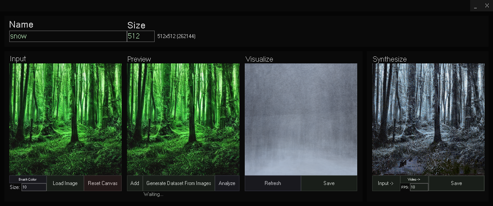

<!-- # [<b>>> Download Latest</b>](https://github.com/o7q/MediaDownloader/releases/latest/download/MediaDownloader.exe) -->
###  ImageSynth is an experimental image processing engine that generates new images based on trained datasets.

---

---

# Overview
ImageSynth builds new images based on features from trained datasets. It can be used to style transfer images and videos. It also can be used to detect and decide what the image is.

*ImageSynth is extremely buggy and primitive and is not designed to be used in a real scenario, its just for fun.*

<!-- ---

## **Interface** -->

---

**ImageSynth** \
Written in C# with .NET Framework 4.8